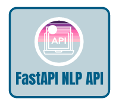

<h1 align="center">Welcome to FastAPI NLP API 👋</h1>
<p align="center">
  
  <a href="https://twitter.com/braian_dev" target="_blank">
    
  </a>
</p>

<p align="center">
  
</p>

> The project is an advanced NLP API that provides sentiment analysis, named entity recognition, and text summarization services. It is built using FastAPI, spaCy, and Hugging Face Transformers, delivering high-quality text processing results through a simple and efficient interface.

<p align="center">
  
</p>

<h2>Installation</h2>

Follow these steps to install and run the project locally:


* Create a Python virtual environment (recommended):

```
python -m venv venv
```

* Activate the virtual environment:

On Windows:

```
venv\Scripts\activate
```

On macOS/Linux:

```
source venv/bin/activate
```

  * Install the dependencies:

``` 
pip install -r requirements.txt
``` 

* Start the FastAPI server:

```
uvicorn main:app --reload
```

<h2>Main Tools Used</h2>

  *  FastAPI: A modern Python framework for building high-performance RESTful APIs. It was chosen for its simplicity, speed, and built-in support for data validation and interactive documentation.

  *  spaCy: An advanced Python library for natural language processing. We use spaCy for the named entity recognition (NER) task due to its efficiency and accuracy in pre-trained models.

  *  Hugging Face Transformers: A cutting-edge library for transformer-based language models, such as BERT, GPT-2, and others. We use Transformers for sentiment analysis and text summarization tasks, as it offers high-quality pre-trained models and easy integration.

These are the main tools used in the project. They were chosen to provide an efficient and effective API service for advanced text and natural language processing.

## Author

<h5>Thank you very much for reading so far. I'm open for everything, and I really hope to see you next time. Best Regards, Braian.</h5>

👤 **Braian Mendes**

* Instagram [@braian.tech](https://www.instagram.com/braian.tech)
* Twitter: [@braian_dev](https://twitter.com/braian_dev)
* Github: [@BraianMendes](https://github.com/BraianMendes)
* LinkedIn: [@braianmendes](https://linkedin.com/in/braianmendes)

## Show your support

Give a ⭐️ if this project helped you!

<a href="https://www.patreon.com/braian_dev">
  
</a>